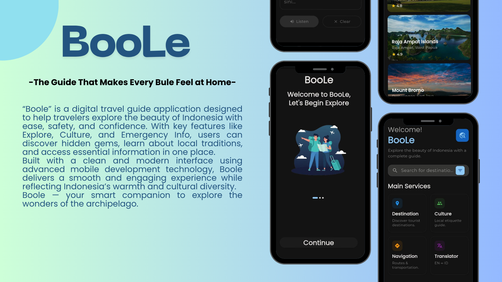
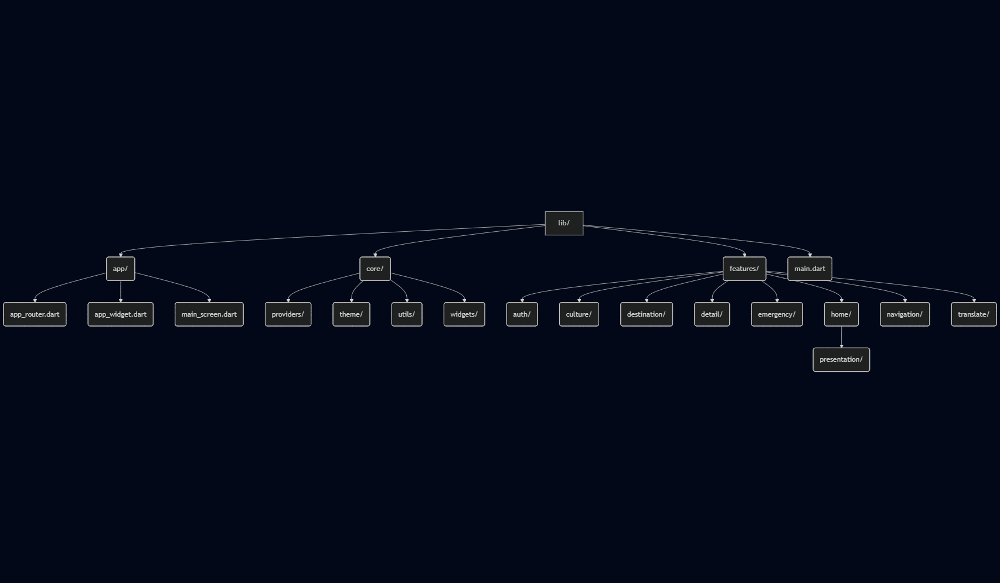
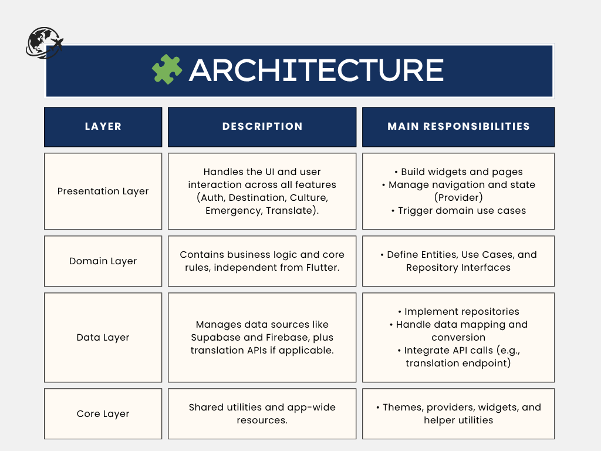

# BooLe — The Guide That Makes Every Bule Feel at Home 🌏

  

> Capstone Project — BEKUP CREATE Upskilling Bootcamp 2025  
> Theme: *Inovasi Teknologi untuk Digitalisasi Wisata Nusantara*  
> Learning Path: **Flutter Development**

---

## 🏕️ Project Overview

**BooLe** is a digital tourism guide app that helps travelers (especially foreign tourists, or “bule”) explore Indonesia with ease.  
It combines destination discovery, local culture insights, and emergency support — all in one mobile app.

---

## 📘 Project Details

| Field | Information |
|-------|--------------|
| **Program** | BEKUP Create: Upskilling Bootcamp 2025 |
| **Capstone Team ID** | **B25-PG022** |
| **Project Title** | BooLe — *The Guide That Makes Every Bule Feel at Home* |
| **Theme** | Inovasi Teknologi untuk Digitalisasi Wisata Nusantara |
| **Learning Path** | Flutter |

---

## 👥 Team Members

| Name | Cohort ID | Status |
|------|------------|--------|
| **Setyo Agung Nugroho** | BC25B042 | ✅ Active |
| **Gunawan** | BC25B047 | ✅ Active |
| **Ikhwan Inzaghi Siswanto** | BC25B092 | ✅ Active |
| **Sande Okta Effendi** | BC25B100 | ✅ Active |

---

## 💡 Features

- 🗺️ **Destination Explorer** — Discover curated tourist attractions across Indonesia.  
- 🏝️ **Cultural Insights** — Learn about local traditions, food, and language tips.  
- 🆘 **Emergency Help** — Quick access to nearby hospitals, police stations, and embassies.  
- 🌙 **Dark & Light Mode** — Adaptive UI that matches system theme.  
- 🔐 **Firebase Authentication** — Secure login and account management for users.
- 🌍 **Translate** — Instantly translate Indonesian text or local phrases into English, helping tourists communicate easily.  

---

## 📁 Folder Structure

The BooLe app (traveleye-apps) adopts a feature-based modular architecture aligned with Clean Architecture principles.
Each module is structured to separate concerns clearly across presentation, domain, and data layers — improving scalability, maintainability, and testability.

  

 ## 🧱 Design Principle

Each feature module is self-contained and follows the flow:
data → domain → presentation

This architecture helps the team:

- Work in parallel across different features

- Reduce merge conflicts during collaboration

- Keep business logic isolated and easily testable

- Maintain a consistent folder structure across modules

---

## 🧩 Architecture

The BooLe app follows the Clean Architecture pattern to ensure modular, maintainable, and scalable development.
This structure separates the app into distinct layers — each with clear responsibilities and one-directional dependencies.

  

🧱 Data Flow
UI (Presentation) → Use Cases (Domain) → Repository (Data) → Data Source (Supabase / Firebase / API)

Clean Architecture Benefits:

- Improves code readability and maintainability

- Enables parallel development between team members

- Keeps UI, business logic, and data access layers isolated

- Simplifies testing and future feature expansion

---

## ⚙️ How to Run

Follow these steps to set up and run the BooLe app locally on your device:

# 1️⃣ Clone the repository
git clone https://github.com/aloha-system/traveleye-apps.git
cd traveleye-apps

# 2️⃣ Install dependencies
flutter pub get

# 3️⃣ Configure environment variables
# Create a .env file or copy from .env.example (if provided)
# Add your Supabase and Firebase credentials

# 4️⃣ Run the application
flutter run

💡 Notes

- Recommended Flutter SDK: ≥ 3.24.0 (stable)

- Make sure your Android Emulator or physical device is connected before running.

- If you encounter a google-services.json missing error, ensure the file is placed in:

android/app/google-services.json

- For iOS users: install CocoaPods dependencies before running:

cd ios
pod install
cd ..
flutter run

## Documentation
Project Plan : [Link](https://docs.google.com/document/d/1nAWP39uIsnCeZ3RnU214iFOfYzX-aCIIPhfMzGt8VaM/edit?usp=sharing)  
Project Brief :  

## Deployment Link APK 

Download Link APK  : 